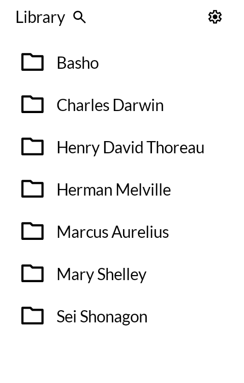
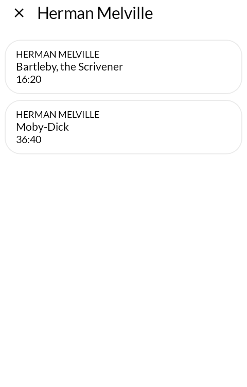
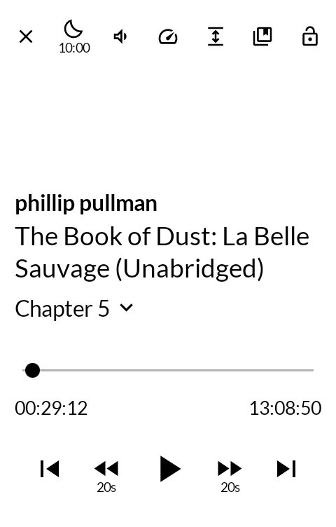
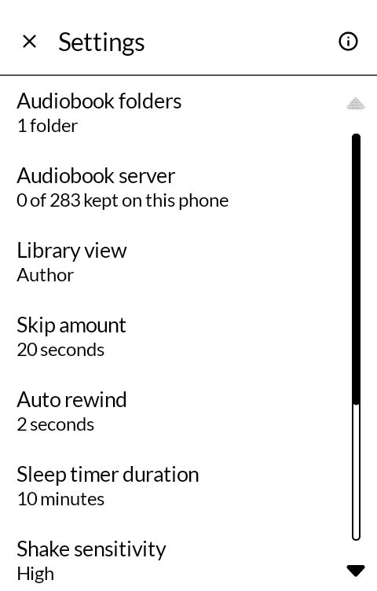

# 耳読 mimidoku — Audio Reading

An audiobook player for the Mudita Kompakt, written from scratch.

*Mimidoku* is 耳読, "ear reading" — a Japanese coinage for taking in books by ear rather than by
eye. It names what the reader is doing rather than the machine doing it.

This is not a fork. The four apps that came before it were forks of other people's work, which is a
fine way to build something and a poor way to own it. This one starts empty and takes on only what
it needs: [Media3](https://developer.android.com/media/media3) for playback, which is the part
nobody should write twice.

| | |
|---|---|
|  |  |
|  |  |

## State

It plays. The order of work was deliberate — the parts that are hard to get right and invisible
when they work came first, and the screens came last — and all of it is now in place.

- [x] Playback service — Media3 session, speech audio attributes, audio focus, pause on unplug
- [x] Reading a folder of books through the document tree
- [x] Remembering where you were
- [x] The screens — library, shelf, player, search, bookmarks, settings

The library is read through the storage access framework rather than from a path, so it works on
a card without asking for permission to read everything on the phone. Three layouts are understood
and a library may be more than one of them at once: audio sitting directly in the chosen folder is
one book; a folder of folders is books; a folder of folders of folders is authors holding books.

Sleep timer -- by hand, or on its own between two hours you set -- playback speed, chapter
list, bookmarks, and a shake to keep the timer going.

Released.

## Getting it, and keeping it

Download <https://github.com/wanderwildwood/mimidoku/releases/latest/download/mimidoku.apk> and
sideload it. That address always points at the newest release, and every release publishes a
`.sha256` beside the APK if you would rather check than trust.

For updates without doing this by hand, add this repository to
[Obtainium](https://github.com/ImranR98/Obtainium):

    https://github.com/wanderwildwood/mimidoku

It will offer each new release as it appears. **The application id is settled** — updates
install over what you have, keeping your settings and anything the app has stored.

## Licence

GPL-3.0-only. See [LICENSE](LICENSE).

Copyright (C) 2026 wander wildwood

This program is free software: you can redistribute it and/or modify it under the terms of the GNU
General Public License, version 3, as published by the Free Software Foundation.

This program is distributed in the hope that it will be useful, but WITHOUT ANY WARRANTY; without
even the implied warranty of MERCHANTABILITY or FITNESS FOR A PARTICULAR PURPOSE. See the GNU
General Public License for more details.

Version 3 only, not "or later": nothing here can be moved onto a licence that has not been written
yet.

The first of these apps whose licence was a decision rather than an inheritance, and now the
default for the rest. Nothing forced it — not a fork, and every dependency is permissive: AndroidX,
Compose, Media3 and Room are all Apache-2.0. Copyleft anyway, because the alternative lets someone
ship this code closed with whatever they care to add to it, and nothing has to come back.

Lato keeps its own licence — SIL Open Font License 1.1, `LICENSES/OFL-1.1.txt`.
